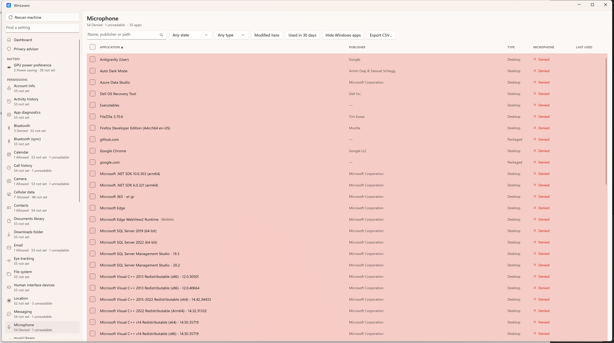
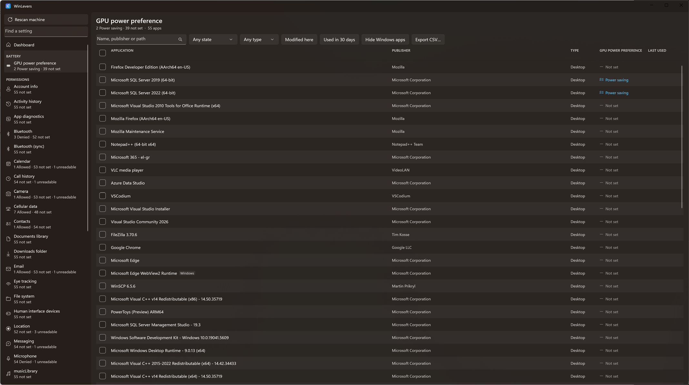
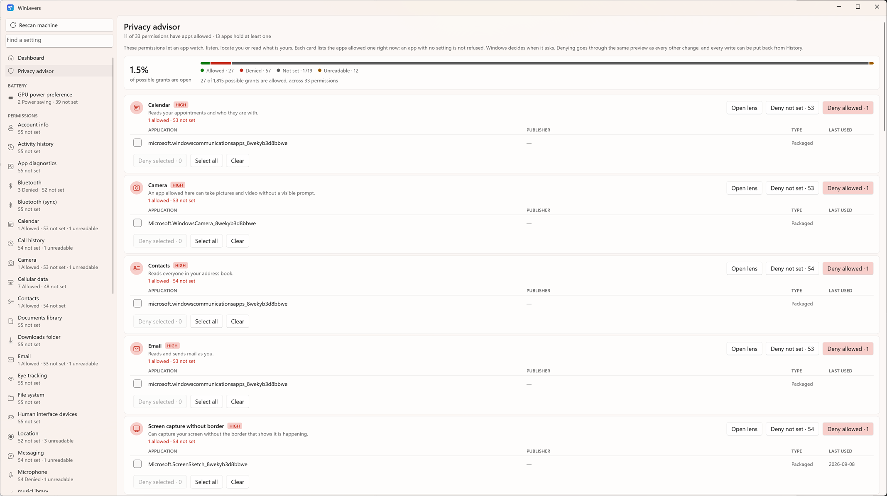
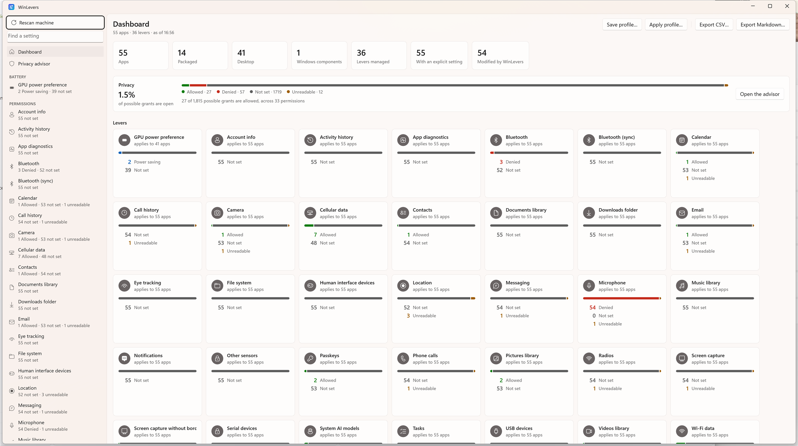
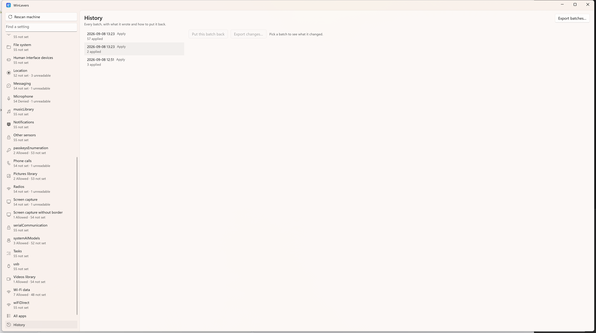
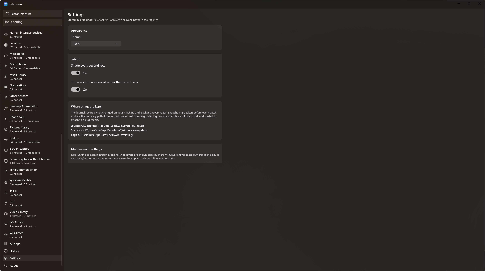

# WinLevers

> Bulk privacy and graphics management for Windows — with full preview, per-change rollback, and zero guesswork.

[](LICENSE)
[](https://dotnet.microsoft.com/)



If you've ever spent an afternoon clicking through nested Windows Settings pages just to turn off microphone access or set GPU preferences across a hundred installed apps, you know the frustration: it’s tedious, there’s no audit trail, and there’s no undo button.

**WinLevers** brings all your installed desktop and packaged apps into a single, clean grid so you can audit permissions at a glance and change them in bulk. Before a single registry key is touched, you see the exact diff of what will change. And if you change your mind, every change that landed can be put back.

---

## What it does

Windows scatters per-app settings across dozens of separate pages:
* **Privacy permissions:** Camera, microphone, location, notifications, contacts, and nearly thirty other capabilities tracked under *Settings → Privacy & security → App permissions*.
* **GPU power preferences:** Choosing power-saving or high-performance graphics per app under *Settings → System → Display → Graphics*.

WinLevers pulls all of these into one place. Two simple concepts organize the app:

* A **Lever** is an individual setting WinLevers manages (like microphone access or GPU preference).
* A **Lens** is the app grid filtered to one specific lever, giving you an instant summary of which apps are allowed, denied, or not yet configured.

Select as many apps as you want, pick a setting, and apply it to all of them in a single operation.

> [!WARNING]
> **Use at your own risk.** WinLevers edits the Windows registry. It is provided as is, without warranty of any kind, and the author accepts no liability for any loss arising from its use. See the [MIT License](LICENSE).

---

## Safety First (Seriously)

Changing registry values in bulk sounds intimidating, so WinLevers is built with deep guardrails at every layer:

* **Always previewed:** Nothing is written in the dark. Every batch generates a full plan showing the old value and the new value, and every change, from any page, goes through that same preview before anything is written.
* **Undo & journal:** Every write records the exact value it replaced into an on-disk SQLite journal (`journal.db`). You can revert an entire batch or individual changes anytime from the **History** tab. A write that fails is recorded as failed and left out of a revert, and if a value was changed by something else in the meantime, the revert detects the drift and leaves it alone.
* **Pre-batch snapshots:** Before any batch writes to the registry, the values it is about to change are saved as human-readable JSON (`snapshots/`) and flushed to disk. The snapshot lives completely separate from the journal so neither failure mode affects the other.
* **Strictly per-user (`HKCU`):** WinLevers never touches `HKLM`, never asks for administrator privileges, and never takes ownership of registry keys or alters ACLs. It edits only the user keys that the Windows Settings app itself touches.
* **100% offline & private:** No telemetry, no background network calls, and no auto-updaters. Everything stays on your machine.
* **Extensively tested:** Registry access is abstracted behind an interface. Over 450 tests run against an in-memory fake registry, ensuring pipelines and rollback semantics are thoroughly verified without touching your actual system.

> [!TIP]
> **Take a System Restore point first.** While WinLevers journals every edit it makes, a Windows System Restore point is the ultimate safety net for system-level changes. WinLevers provides a direct shortcut to create one right from its launch notice.

---

## Feature Tour

### 1. The App Grid & Bulk Lenses
Filter by any lever in the sidebar to inspect permissions across desktop and packaged apps. Bulk-select apps to allow or deny capabilities in one pass.



### 2. Privacy Advisor
A high-level health check highlighting the most sensitive capabilities (Camera, Microphone, Location). It breaks down which apps currently hold them, provides one-click options to revoke access, and shows your machine's overall privacy posture in a single bar.



### 3. Dashboard
An instant overview of your machine's state across all configured levers, with counts of allowed, denied, and unconfigured apps from the latest scan.



### 4. History & Rollback
Review every batch you've ever applied, inspect exactly what each write changed, and roll back changes with one click.



---

## What WinLevers Never Does

To keep your system clean and predictable, WinLevers commits to these rules:
- Never writes without an explicit preview confirmation.
- Never touches machine-wide settings (`HKLM`).
- Never asks for Administrator privileges.
- Never takes ownership of registry keys or modifies permissions.
- Never overwrites a registry key whose format it doesn't recognize.
- Never reverts a value that was modified externally after WinLevers wrote it.
- Never stores its own settings inside the registry it manages.

---

## Quick Start

### Why build from source?
There are no pre-compiled binary releases. Because WinLevers interacts directly with system registry keys, you should always know exactly what code is running on your machine. You build it from source you can inspect and verify.

### Prerequisites
* **.NET 10 SDK**
* **Visual Studio 2026** (or compatible) with:
  * **.NET Desktop Development** workload
  * **Windows App SDK** component
  *(The C++ workload is not required)*

### Building and Running
1. Clone the repository and open **`WinLevers.sln`**.
2. In Solution Explorer, right-click **WinLevers.App** and select **Set as Startup Project**.
3. Set the solution platform dropdown to **x64** (or **ARM64** on ARM devices).
4. Press **F5**.

When the app launches, you'll see a brief safety notice. Check the confirmation box to enter the Dashboard. Behind the scenes, your system is scanned and ready—nothing will be written until you review and confirm a preview.

---

## Where Data Lives

WinLevers keeps all of its state isolated in `%LOCALAPPDATA%\WinLevers`:
* `journal.db` — SQLite database tracking every batch and registry write for rollback.
* `snapshots/` — JSON snapshots created immediately before any batch execution.
* `logs/` — Diagnostic application logs. Check the newest file if you run into any issues.
* `settings.json` — UI preferences (theme, window position, table options).



---

## Troubleshooting

* **Visual Studio shows "unknown project configuration mappings":**  
  Close Visual Studio and delete the hidden `.vs/` directory next to the solution. VS caches project configurations and can get confused after pulling updates.
* **Build fails mentioning `VC\Tools\MSVC`:**  
  If the C++ workload isn't installed, the Windows App SDK's XAML targets can attempt an unguarded folder lookup. `WinLevers.App.csproj` includes a workaround, or you can install the **Desktop development with C++** workload in Visual Studio.
* **F5 launches the CLI instead of the GUI:**  
  Visual Studio stores startup project choices per-user. Right-click **WinLevers.App** and choose **Set as Startup Project**.

---

## Under the Hood

### Architecture & Tech Stack
* **C# / .NET 10** with a **WinUI 3** shell ([Windows App SDK](https://github.com/microsoft/windowsappsdk)).
* **CommunityToolkit.Mvvm** for view models.
* **EF Core + SQLite** for the audit journal.
* **xUnit** with 450+ unit tests.

The solution is cleanly separated so that the engine and view models live in `WinLevers.Presentation` and `WinLevers.Core`—completely independent of the WinUI shell. This allows all logic, pipelines, and view models to be tested without launching a GUI or touching a real registry.

Detailed technical design and decisions are documented in [docs/architecture.md](docs/architecture.md) and [docs/design.md](docs/design.md).

### Cross-Platform Development (macOS & Linux)
You can build and test the entire engine on macOS or Linux using **`WinLevers.Engine.slnx`**:

```bash
dotnet test WinLevers.Engine.slnx
```

*(On Windows, always build `WinLevers.sln` so the WinUI shell is compiled.)*

### The Command-Line Interface (CLI)
WinLevers includes a CLI tool sharing the same underlying engine. Useful for automated probes, scripting, or headless environments:

```bash
# Scan installed apps and levers
dotnet run --project src/WinLevers.Cli -- scan

# List available levers
dotnet run --project src/WinLevers.Cli -- levers

# Dry-run a plan (writes nothing)
dotnet run --project src/WinLevers.Cli -- plan --set <leverId>=<value> --app <substring>

# Probe registry structures
dotnet run --project src/WinLevers.Cli -- probe
```

### Self-Contained Deployment
To build a standalone folder that runs without requiring .NET or the Windows App SDK to be pre-installed on the target machine:

```bash
dotnet publish src/WinLevers.App -c Release -r win-x64 -p:Platform=x64 --self-contained true -p:WindowsAppSDKSelfContained=true
```
*(Use `-r win-arm64 -p:Platform=ARM64` on ARM64 hardware).*

---

## Project Status & Forking

WinLevers was created as a personal utility to solve a specific problem on my own machines. It is complete for its intended purpose. Because of this:
* **No contributions or support:** The project does not accept pull requests, feature requests, or issue reports, and there is no dedicated support channel.
* **Free to fork:** The code is licensed under the permissive [MIT License](LICENSE). You are completely free to fork it, adapt it, build upon it, and take it in whatever direction you like!

See [CONTRIBUTING.md](CONTRIBUTING.md) for conventions, reading order, and guidelines on keeping registry changes safe in your fork.

---

## Behind the Project

I'm [Dimitrios T](https://github.com/dimitriostzr). I built WinLevers because managing permissions across hundreds of apps on my personal workstations was eating hours of time with zero safety net.

**How it was built:** Claude wrote much of the code and test suite to my architectural design and under my close review and testing. Every design decision, guardrail, and choice in this repository was deliberate and mine.

---

## Trademarks & Disclaimers

WinLevers is an independent personal project. It is **not affiliated with, endorsed by, sponsored by, or supported by Microsoft Corporation**, nor by any software vendor whose applications appear in its interface.

Microsoft, Windows, Visual Studio, WinUI, and .NET are trademarks or registered trademarks of Microsoft Corporation in the United States and other countries. All other application names and trademarks belong to their respective owners and are used purely for nominative identification.

---

## License

Copyright (c) 2026 Dimitrios T.  
Licensed under the [MIT License](LICENSE).
