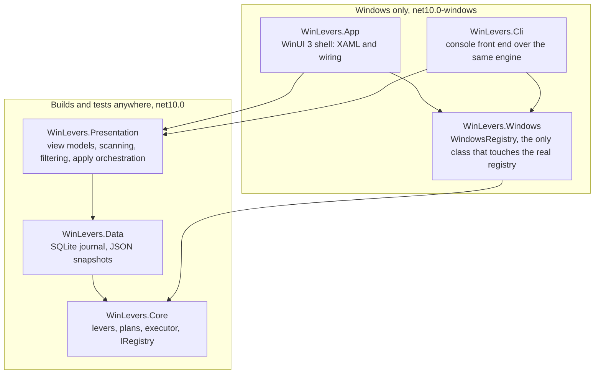
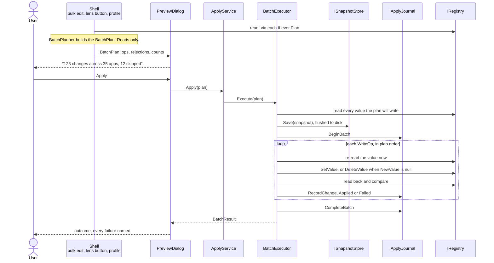
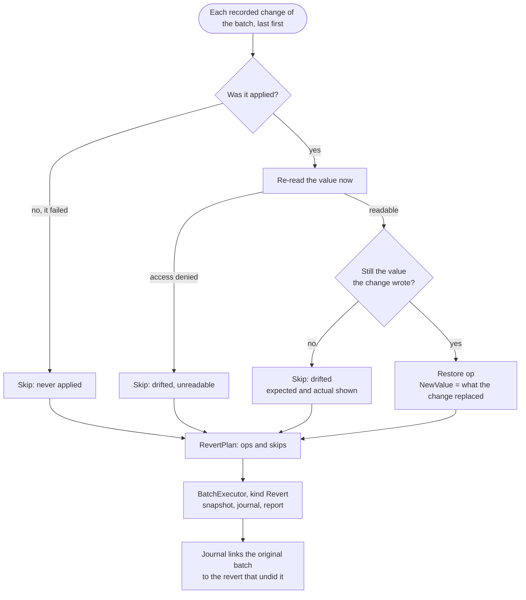

# WinLevers — architecture

**As built, September 2026, version 0.1.0.** This is the current-state
reference. It says what the pieces are, how a change travels from a checkbox
to the registry and back out, and which rules the tests pin. It does not say
why the app is shaped this way; that is the [design](design.md), a historical
record whose *Decisions* section is the place to start when something here
looks odd. Where the two disagree, this page is right. How to build and run
the app is in the [README](../README.md).

The diagrams are Mermaid. GitHub renders them; a plain editor shows the
source, which reads well enough on its own.

## The shape of it

Six projects. The line that matters runs between the two that can only be
built on Windows and the four that build and test anywhere.

The shell and the CLI also reference Core and Data directly; the diagram
shows the layering, not every edge. Each test project references exactly one
source project.

| Project | Holds |
|---|---|
| `WinLevers.Core` | `AppIdentity` and the inventory scan, `ILever` and its two implementations, `BatchPlanner`, `BatchExecutor`, `RevertPlanner`, and the `IRegistry`, `IApplyJournal` and `ISnapshotStore` seams. Uses only the base class library. |
| `WinLevers.Data` | `SqliteApplyJournal` over EF Core, `JsonSnapshotStore`. |
| `WinLevers.Presentation` | `MachineScan`, every view model, filters, profiles, the privacy catalogue, CSV export, `CommandLine` parsing, `UiSettings`. Depends on CommunityToolkit.Mvvm, which is platform-neutral. |
| `WinLevers.Windows` | `WindowsRegistry`. Nothing else. |
| `WinLevers.App` | Views, the composition root, the preview dialog, the diagnostic log. No logic that could live one layer down. |
| `WinLevers.Cli` | `scan`, `levers`, `plan`, `apply`, `probe`, `history`, `revert`. |

The rule behind the split: XAML cannot be compiled off Windows, and the engine
is where every edge case lives. So the engine never names the real registry,
and the view models live in Presentation rather than in the shell, where
nobody could test them.

## Four abstractions

Almost everything is built from these.

**`IRegistry`** is the seam. Four reads, two writes, and one contract: every
access failure surfaces as `RegistryAccessDeniedException`, so a scan across
hundreds of keys owned by other applications marks one row unreadable rather
than dying. `InMemoryRegistry` is the test double; `WindowsRegistry` is the
real one and opens both hives through the 64-bit view explicitly, so the
Uninstall scan can address `WOW6432Node` by path as a source of its own.

**`ILever`** is one managed setting. It is constructed over a registry, reads
an app's state, and plans a change without writing. There are two
implementations. `ConsentStoreLever` is instantiated once per capability the
machine actually has under `ConsentStore`, so a capability added by a Windows
update is readable and writable before it has a display name.
`GpuPreferenceLever` manages `UserGpuPreferences`, where the value *name* is
the executable path. Nothing about paths is shared between the two.

**`LeverState`** is what a lever reports for an app.

| Kind | Meaning |
|---|---|
| `NotApplicable` | The lever does not exist for this app. Shown as such, never as unset. |
| `NotSet` | No recorded preference. Windows decides. |
| `Set` | An explicit value, in the lever's own wire format. |
| `Mixed` | The app's executables disagree. |
| `Unrecognised` | The key holds a shape the lever cannot parse. Reported, never written into. |

An app with several executables aggregates: `Unrecognised` wins over
everything, any disagreement is `Mixed`, otherwise the common value.

**`WriteOp`** is one registry write, shaped so it can become one journal row.
It carries the old and the new value, and `null` on either side means
*absent*: an absent old value is journaled as null, and a null new value is a
delete. `NotSet` is not `Deny`, and collapsing them would make a revert grant
nothing back while looking like a success. A lever that fans out across four
executables produces four ops with four old values.

## Scanning

`MachineScan.Read` is the one place the shell reads the registry. It builds
the lever set from the capabilities the machine has, scans the inventory, and
reads every lever for every app once. The result is a snapshot: the grid never
touches the registry on scroll, and staleness is answered by *Rescan machine*,
not by polling.

The inventory is unioned from three registry sources. The Uninstall keys under
`HKLM`, `HKLM\WOW6432Node` and `HKCU` supply display names, publishers and
install locations. `ConsentStore` sub-key names supply the package family
names and executable paths that already hold a grant. `UserGpuPreferences`
value names supply executables that hold a GPU preference. `InventoryMerge`
attaches each executable to an Uninstall entry: one that names it outright
wins, otherwise the entry whose install location contains it, most specific
first, otherwise the executable stands alone as its own row.

The `PackageManager` source the design lists is not used, because it needs
WinRT and cannot live in Core. So packaged apps appear under their family
names, and only once they hold a grant.

## The apply pipeline

Five stages, and the middle three are where the app earns trust. The plan is
pure, the preview is the only gate, and the executor snapshots and journals
around every write.

1. **Plan.** `BatchPlanner` takes the selection and the levers the user moved
   and asks each lever for a `LeverPlan`. Ops for a value already at target,
   for a lever that does not apply, or for a key of unrecognised shape come
   back as rejections rather than being dropped, because the preview has to
   count them. Planning reads and never writes, so a plan can be built,
   shown and thrown away.
2. **Preview.** In the shell, `PreviewFlow` is the one route from a plan to
   the registry. Bulk edit, the lens buttons on the selection bar, the
   privacy advisor and a saved profile all end there, and `PreviewDialog` is
   the only place an Apply button exists. The CLI prints the same plan on the
   console and asks before writing; `--yes` answers for scripts.
3. **Snapshot.** `BatchExecutor` reads every value the plan will touch and
   hands them to `ISnapshotStore`, which writes JSON and flushes it to disk
   before returning. The snapshot is scoped to that batch's writes. An empty
   plan takes no snapshot and opens no batch.
4. **Execute.** Ops run sequentially in plan order. Each one re-reads the
   value immediately before writing, so the journal records what was actually
   replaced rather than what the scan saw. A null new value deletes. After
   writing, the value is read back and compared; a key that accepted the
   write and kept its old content is a failure, not a success. Every op is
   journaled as it lands, committed row by row, so a crash mid-batch leaves a
   journal that describes the writes that already happened. A failure never
   stops the ops after it.
5. **Report.** The batch is closed with its counts, and the shell lists every
   failure with its cause.

`ApplyService` in Presentation wraps the executor, the journal and the revert
planner so the shell holds no apply logic of its own. It is synchronous by
design and the shell runs it off the UI thread.

## Revert

A revert is not a special execution path. It is planned by re-reading the
machine, turned into an ordinary batch and run through the same executor,
which is what makes a revert itself revertible.

Changes are unwound last-first, so two writes to one value restore correctly.
A change that never applied replaced nothing and is left alone. A value that
is no longer what the change wrote has been changed by something else since,
and the revert leaves it alone; `RevertSkip` carries the expected and actual
values so the shell can show both. There is no per-item override. Null on both sides is a match: a
deletion has been left alone if the value is still absent. The restore op
sets the new value to what the original change replaced, and null there
deletes rather than writing a default.

## What is on disk

Everything lives under `%LOCALAPPDATA%\WinLevers`. Nothing of the app's own
goes into the registry it edits.

| File | Written by | Holds |
|---|---|---|
| `journal.db` | `SqliteApplyJournal` | `Batches` and `Changes`. One change row per registry write, committed as it is made. A batch's `RevertedBy` points at the batch that undid it. Values are stored with their registry kind so a `REG_EXPAND_SZ` never comes back as a `REG_SZ`. |
| `snapshots\<batchId>.json` | `JsonSnapshotStore` | The values a batch was about to write, as they stood, flushed before the first write. Kept apart from the journal so the two do not share a point of failure. The store can load one back; no restore path is built yet. |
| `logs\winlevers-<date>.log` | `AppDiagnostics` | What the application did: unhandled exceptions and faults. Never what is on the machine. This is where to look when something went wrong. |
| `settings.json` | `UiSettingsStore` | Theme, table options, window placement. |
| profile files | `Profile` | Wherever the user saves them. Every explicit setting on the machine, keyed so a desktop app can be found again by executable name rather than by a path that exists on one machine only. |

## The shell

`AppHost` is the composition root and the only place `WindowsRegistry` is
named. Every view model takes `IRegistry`, which is what lets all of them be
tested against the in-memory fake. One journal is opened for the life of the
process.

Views are XAML with code-behind that binds and forwards; the state they show
is on view models in Presentation. `ShellViewModel` holds the one scan every
lens is computed from and the one row list every filter narrows. Selection
lives on the rows, so it survives switching lens and changing filters, which
is the workflow the app exists for.

Every unhandled exception is logged and, where possible, swallowed rather
than allowed to kill the window: a process that writes to other
applications' keys must not vanish mid-batch without a trace.

The CLI is the same engine without a window. `scan`, `levers`, `plan` and
`probe` write nothing; `apply` and `revert` go through the same executor and
journal as the shell.

## Invariants the tests pin

The engine has tests for every rule it enforces. The ones that matter most:

- No write happens without a plan the user has seen. In the shell, only the
  preview dialog applies one. In the CLI, `apply` and `revert` print the plan
  and ask, unless `--yes` was passed.
- The snapshot is flushed to disk before the first registry write.
- One journal row per registry write, committed as it is made.
- Every write re-reads before and reads back after, and a read-back mismatch
  is a failure.
- Absent is `null`, in the journal, the snapshot and the op. Reverting to
  *not set* deletes; it never writes a default.
- A revert never writes over a value that has drifted, and never undoes a
  change that failed.
- A lever never writes into a key whose current shape it cannot parse.
- Everything shipped in 0.1.0 writes under `HKCU`. Machine scope is shown
  inert and is untargetable unless the process is elevated.
- The app never takes ownership of a key or rewrites an ACL.

Counts as of September 2026, all xunit, all against the in-memory registry:

| Suite | Tests |
|---|---|
| `WinLevers.Core.Tests` | 234 |
| `WinLevers.Presentation.Tests` | 194 |
| `WinLevers.Data.Tests` | 29 |

`WindowsRegistry` has no automated tests. It is exercised by hand on a
Windows machine, and any test written for it must confine itself to a sandbox
key such as `HKCU\Software\WinLevers\TestHive`.

## Where to look

- A new lever: implement `ILever` in Core, add it to `LeverSet`, and write a
  test per state transition. `GpuPreferenceLever` is the smaller example.
- A new capability: one line in `CapabilityCatalog`, and one in
  `PrivacyCatalog` if it deserves a card on the advisor.
- The exact registry locations: `ConsentStorePath`, `GpuPreferenceLever`,
  `UninstallScan`, and the lever catalogue in the [design](design.md).
- What the preview counts mean: the remarks on `BatchPreview` and
  `LeverPlan`.
- Why a value is stored the way it is: `RegistryValueCodec` and the DTOs in
  `JsonSnapshotStore`.
